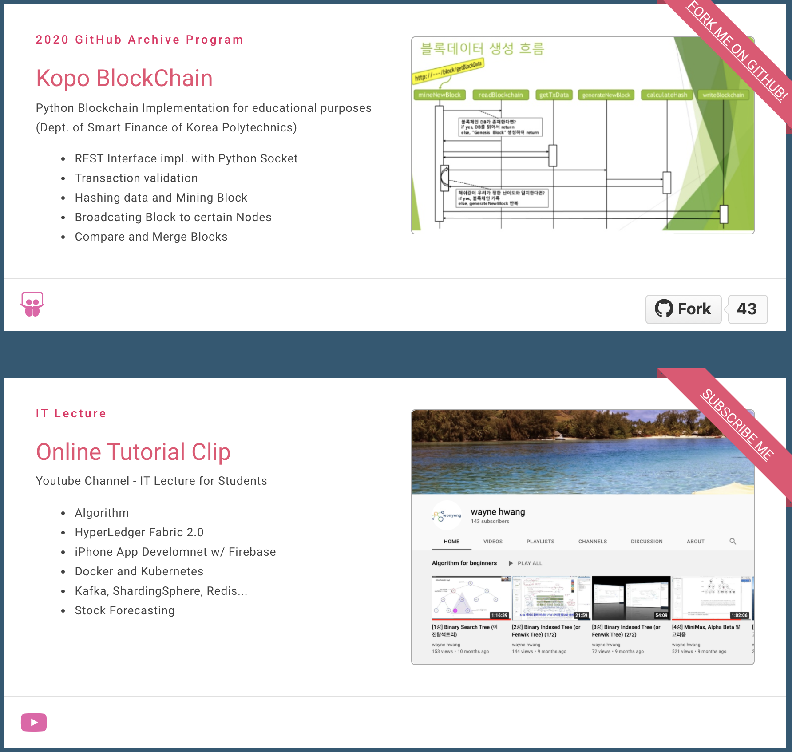
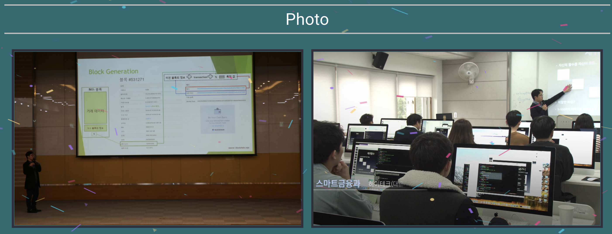

[](https://app.netlify.com/sites/kopo/deploys)

# Kopo Profile

* Vue.js Practice repo for educational purpose. 
* And it will be used by korea polytechnics college students in their front-end class.
* This repo is forked from https://github.com/mayank091193/mayank-profile.


## Site: [https://kopo.netlify.app/#/](https://kopo.netlify.app/#/)

## Resources used
* [Quasar Framework](https://quasar.dev/)
* [Vue.js](https://vuejs.org/)


## Installation

* **Clone the repository**
```
git clone https://github.com/wonyongHwang/kopoProfile.git
```

## Install the dependencies
```bash
cd kopoProfile
npm install
```


### Start the app in development mode 
```bash
quasar dev
```

### Build the app for production
```bash
quasar build
```
## Screens UI
**Home**
<p float="left">
	<kbd>

		</kbd>
</p>

**Projects**
<p float="left">
	<kbd>
	
	</kbd>
</p>

**Sketches**
<p float="left">
	<kbd>

	</kbd>
</p>


### Customize the configuration
See [Configuring quasar.conf.js](https://quasar.dev/quasar-cli/quasar-conf-js).


## License

[MIT](http://opensource.org/licenses/MIT)

## Original Source (forked from)
https://github.com/mayank091193/mayank-profile
